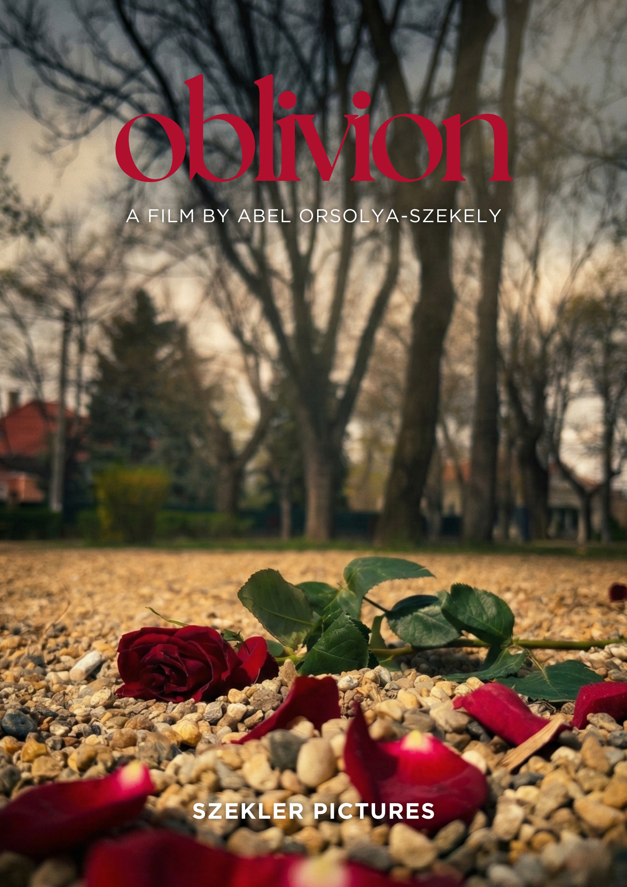
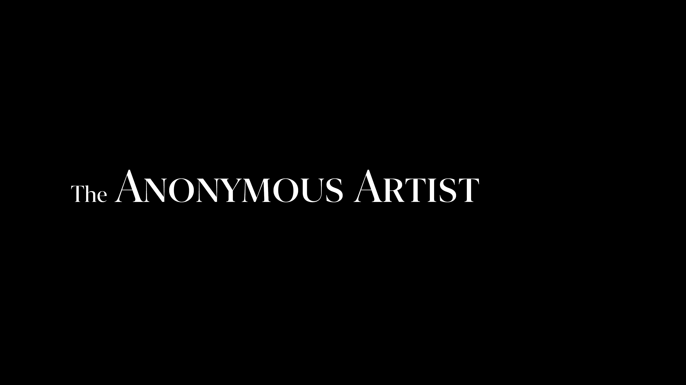
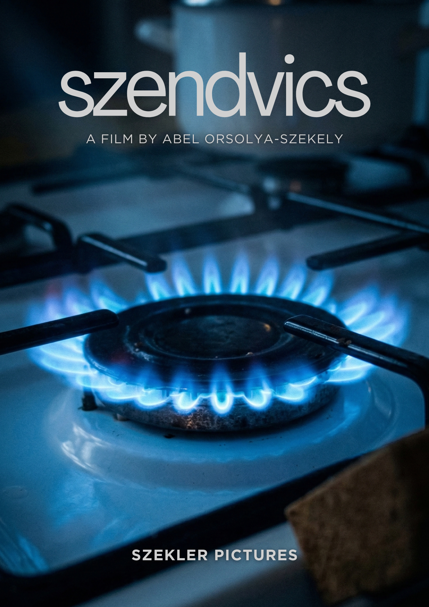
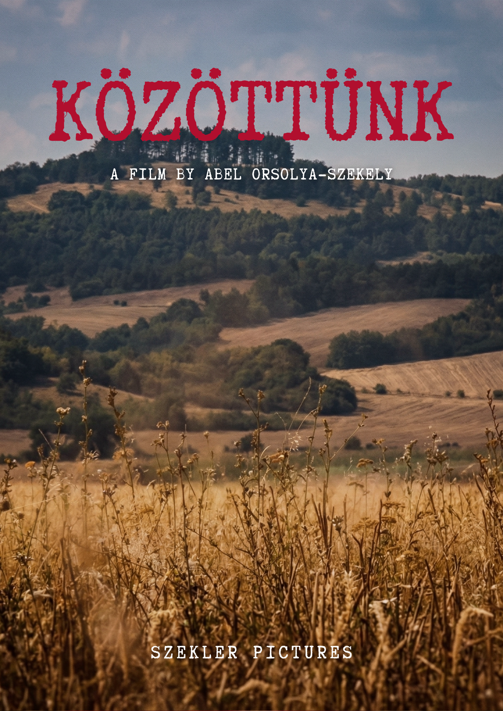
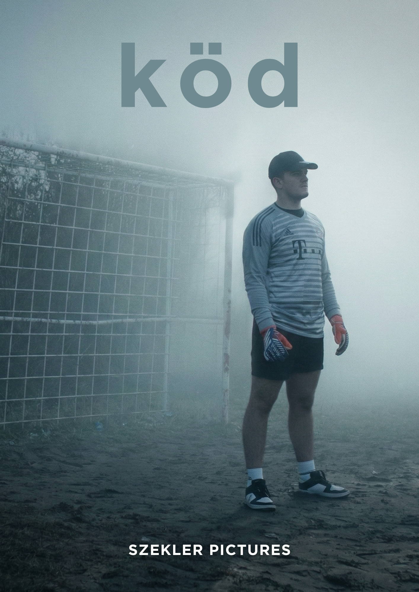

# Szekler Pictures • Kezdőlap
**Kezdőlap** | Filmek | Rólunk | Kapcsolat

### Történetek a szívünkből, képernyőre álmodva.
[videó: meglévő filmekből egy rövid montázs]

Fügetlen filmkészítés határok nélkül

{Legutóbbi filmünk megtekintése gomb}

### Kiemelt alkotás: A rejtélyes festő
[videó: A Rejtélyes festő film - YouTube]

**Leírás:** Az olasz _Summary of art ... in short_ pályázat győztes filmje egy titokzatos festő és annak művei körül forgó izgalmas krimi. Vajon kiderül, hogy ki is a gyilkos?

### Szekler Pictures - Így látjuk mi

Nem várunk a tökéletes pillanatra vagy a hatalmas költségvetésre – mi egyszerűen csak forgatunk. Rövidfilmjeink a kísérletezésről, a tanulásról és a történetmesélés öröméről szólnak. A Szekler Pictures egy kreatív műhely, ahol az amatőr lelkesedés találkozik a profi szemlélettel. Nem világmegváltó eposzokat akarunk gyártani, hanem olyan pillanatokat, amikbe érdemes belenézni 3-5 perc erejéig.

---
**Szekler Pictures • 2026** | **Kezdőlap** | Filmek | Rólunk | Kapcsolat

# Szekler Pictures • Filmek
Kezdőlap | **Filmek** | Rólunk | Kapcsolat

### Legújabb filmünk:
#### Oblivion
_Egy rövid filmetüd a szerelemről_

| **Film adatai** | |
|-----------------|-|
| **Cím:** | _Oblivion_ |
| **Bemutató dátum:** | 2025\. április 10. |
| **Rendezte:** | Orsolya-Székely Ábel |
| **Főszerepben:** | Bartha Bence és Fata Bíbor |

{Megtekintés gomb}

### A Rejtélyes Festő
Van egy híres és egyben titokzatos festő, akinek festményei az új szenzációk. Egy napon egy nyomozó rájön, hogy a festő összes festménye olyan bűncselekményeket ábrázol, amelyek valóban megtörténtek. És egyiket sem sikerült megoldani…

| **Film adatai** | |
|-----------------|-|
| **Cím:** | _A Rejtélyes Festő_ |
| **Angol cím** | _The Anonymous Artist_ |
| **Bemutató dátum:** | 2023\. október 29. |
| **Rendezte:** | Orsolya-Székely Ábel és Pünkösti Anna |
| **Főszerepben:** | Orbán Olivér |

{Megtekintés gomb}

### További műveink

---
**Szekler Pictures • 2026** | Kezdőlap | **Filmek** | Rólunk | Kapcsolat

# Szekler Pictures • Rólunk
Kezdőlap | Filmek | **Rólunk** | Kapcsolat

### Küldetésünk: Minden perc számít
Hiszünk abban, hogy a legerősebb történeteknek nincs szükségük kétórás játékidőre és dollármilliókra. A Szekler Pictures-nél 2 és 7 perc közé sűrítjük azt, ami szerintünk igazán fontos: az **őszinte pillanatokat**, a **váratlan fordulatokat** és a **nyers érzelmeket**. Nem azért forgatunk, mert minden technikai eszközünk megvan hozzá, hanem azért, mert van mondanivalónk. Célunk, hogy a független filmkészítés szabadságával olyan ablakokat nyissunk a világra, amiken bárki szívesen benéz egy kávészünetnyi időre.

### A Szekler-módszer: Alkotva tanulni
A Szekler Pictures nem egy statikus stúdió, hanem egy élő kísérlet. Módszerünk alapja a **folyamatos fejlődés**: minden filmünk egy-egy lecke. Nem félünk a hibáktól, mert minden életlen képkocka vagy döccenő közelebb visz minket a következő szinthez. Nálunk az ’amatőr’ szó az eredeti jelentését hordozza: valaki, aki szerelemből csinálja. Ezzel a szenvedéllyel nyúlunk a kamerához minden egyes forgatási napon.

### Mérföldkövek
2022\. március 7. - Szendvics (Első filmünk)

2022\. augusztus 12. - Közöttünk

**2023\. október 29. - A Rejtélyes festő** (_Summary of art ... in short_ olasz pályázat győztes filmje)

2025\. március 23. - A Köd

2025\. április 10. - Oblivion

### Mivel dolgozunk?
Felszerelésünk: Egy Olympus gép, egy iPhone 15, rengeteg lelkes barát, és végtelen mennyiségű kávé

**Szekler Pictures • 2026** | Kezdőlap | Filmek | **Rólunk** | Kapcsolat

# Szekler Pictures • Kapcsolat
Kezdőlap | Filmek | Rólunk | **Kapcsolat**

### Maradj velünk kapcsolatban!
Értékelj minket! Mondd el, hogy tetszett neked filmeink. Fontos számunkra a vélemények, mert azokból tanulva tudunk jobbnál jobb kávészünetnyi hosszúságú filmecskéket gyártani.

**Saját adatok**

_Név:_

{egysoros, szöveges beviteli mező}

_E-mail cím:_
{egysoros, szöveges beviteli mező}

**Értékelés**

_Értékelendő film címe:_

{egysoros, szöveges beviteli mező}

_Hogy tetszett? Értékeld 5-ös skálán!_

{rádiógombok 1-től 5-ig}

_Miért gondolod így?_

{szövegterület}

{jelölőnégyzet}  Fel szeretnék iratkozni a Szekler Pictures hírlevelére

{Elküldés gomb}

---

**Szekler Pictures • 2026** | Kezdőlap | Filmek | Rólunk | **Kapcsolat**